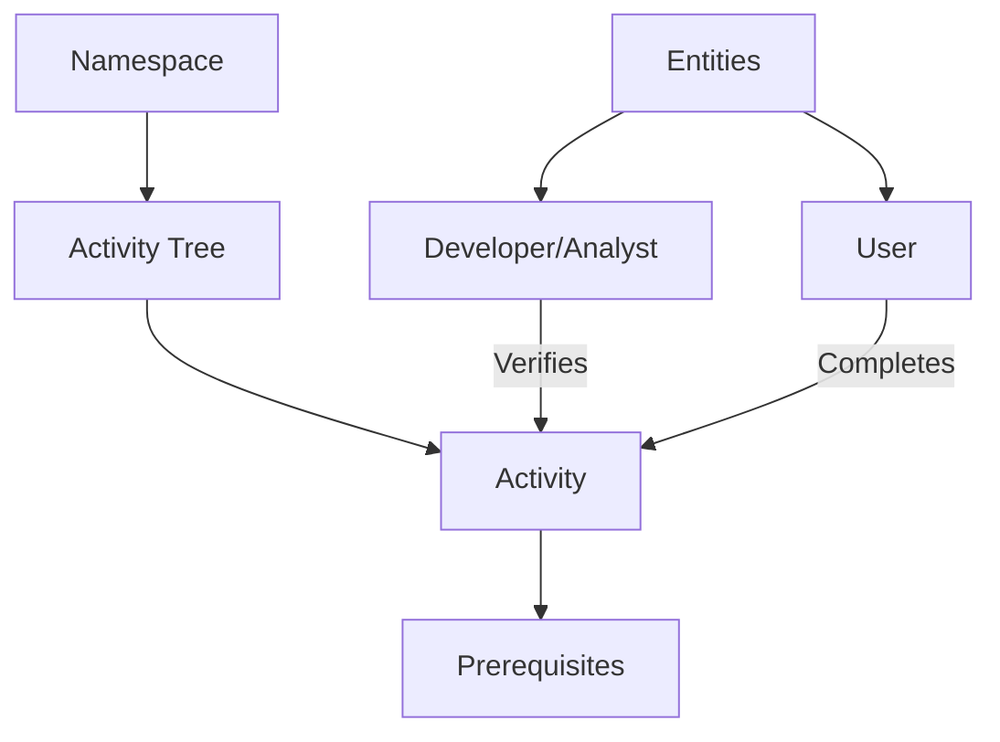

# Web3 Monitor: Decentralized Activity Tracking

A blockchain-based activity tracking system that provides comprehensive monitoring and verification of web3 interactions, creating an immutable record of decentralized ecosystem achievements.

## Overview

Web3 Monitor is designed to create a transparent environment where developers, analysts, and users can track and verify web3 interactions using blockchain technology. The system represents ecosystem activities as nodes in interconnected activity namespaces, providing detailed insights while maintaining a permanent, trusted record of achievements.

### Key Features
- Cross-protocol activity tracking
- Complexity-based progression metrics
- Immutable verification of web3 interactions
- Multi-stakeholder collaboration (Admin, Developer, Analyst, User)
- Prerequisite-based activity progression
- Comprehensive interaction monitoring

## Architecture

The Web3 Monitor system is built around a core smart contract that manages entities, relationships, and web3 activity tracking organized in namespace structures.



### Core Components
- **Entities**: Four distinct roles (Admin, Developer, Analyst, User)
- **Namespaces**: Collections of related activity trees
- **Activities**: Individual interaction achievements
- **Relationships**: Cross-entity connections
- **Completions**: Verified interaction records

## Contract Documentation

### web3-activity-tracker.clar
The main contract managing the Web3 Monitor platform's functionality.

#### Key Maps
- `entities`: Stores entity information and roles
- `namespaces`: Defines collections of activity trees
- `activities`: Stores web3 interaction definitions
- `activity-completions`: Tracks verified interactions
- `entity-relationships`: Manages authorized relationships

#### Access Control
- Role-based access control
- Relationship-based permissions for activity verification
- Flexible interaction tracking mechanisms

## Getting Started

### Prerequisites
- Clarinet
- Stacks blockchain wallet
- Web3 development environment

### Basic Usage

1. Register an entity:
```clarity
(contract-call? .web3-activity-tracker register-entity "Web3 Developer" u2) ;; Register as developer
```

2. Create a namespace:
```clarity
(contract-call? .web3-activity-tracker create-namespace "Protocol Research" "Advanced web3 protocol studies")
```

3. Create an activity:
```clarity
(contract-call? .web3-activity-tracker create-activity 
    "Smart Contract Analysis" 
    "Comprehensive analysis of cross-chain smart contract patterns" 
    "Research" 
    u3 
    u1 
    none)
```

## Function Reference

### Entity Management

```clarity
(register-entity (name (string-ascii 100)) (role uint))
(create-relationship (related-entity principal) (relationship-type (string-ascii 20)))
```

### Namespace Management

```clarity
(create-namespace (name (string-ascii 100)) (description (string-ascii 500)))
```

### Activity Management

```clarity
(create-activity (title (string-ascii 100)) 
                 (description (string-ascii 500))
                 (category (string-ascii 50))
                 (complexity-level uint)
                 (namespace-id uint)
                 (parent-activity-id (optional uint)))

(complete-activity (activity-id uint) 
                   (entity-id principal) 
                   (evidence-hash (optional (string-utf8 64))))
```

## Development

### Testing
1. Clone the repository
2. Install Clarinet
3. Run `clarinet test` to execute test suite
4. Use `clarinet console` for interactive testing

### Local Development
1. Set up local Clarinet chain
2. Deploy contracts using `clarinet deploy`
3. Interact with contracts through the console or API

## Security Considerations

### Permissions and Access Control
- Only authorized entities can verify activities
- Relationship-based access controls
- Role-specific interaction permissions

### Known Limitations
- Activity prerequisites are immutable once set
- Evidence verification requires external validation
- Complexity levels provide relative, not absolute, metrics

### Best Practices
- Establish clear entity relationships
- Include cryptographic evidence when completing activities
- Follow prerequisite patterns for structured progression
- Regularly audit interaction records